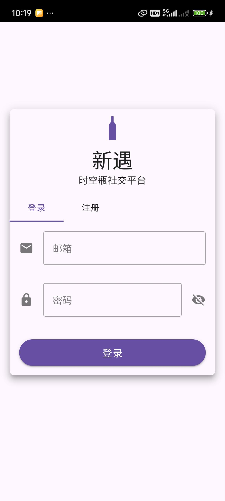
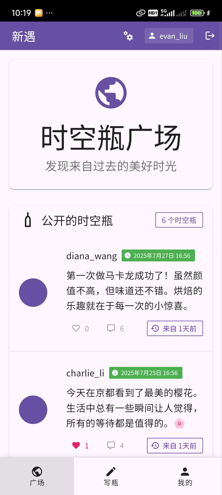
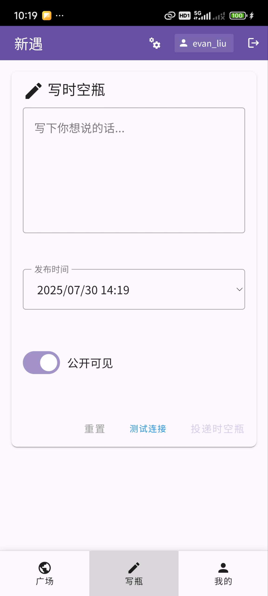
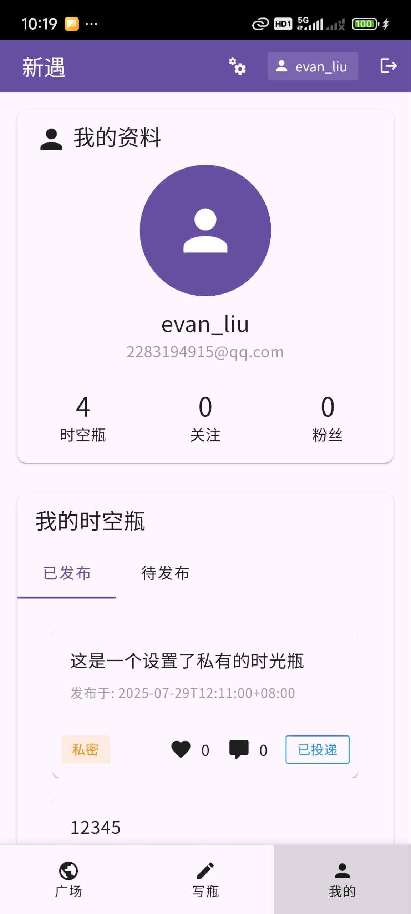

# 遇愿 - 时光瓶社交应用

<div align="center">
  
  <h3>发现时光的美好，实现心中的愿望</h3>
</div>

## 📱 演示版体验

> **🎯 零成本演示方案**: 完全离线运行，无需服务器维护，适合技术展示和面试演示

### 📥 立即下载体验
- **[📱 Android APK 下载](https://github.com/renranr/yuyuan/releases/latest)**
- **系统要求**: Android 5.0+  
- **文件大小**: ~6MB
- **网络需求**: 完全离线运行

### 🚀 快速上手
1. **下载安装** APK到Android设备
2. **任意登录** - 使用任意邮箱+密码即可进入（演示特性）
3. **立即体验** - 浏览6条真实演示内容，完整功能体验

### 📺 应用截图
<div align="center">
  
  
  
  
</div>

### 🎬 功能演示
📹 [**观看完整功能演示视频**](./images/视频演示流程.mp4)

### 📖 详细文档
- 📋 [**使用指南**](./docs/使用指南.md) - 完整的体验流程和功能说明
- 🏗️ [**技术架构**](./docs/技术架构.md) - 详细的技术实现和架构设计

---

## 🌟 项目特色

### 💡 产品创新
- **时光瓶概念** - 独特的延时社交体验
- **情感共鸣** - 记录美好时光，传递正能量  
- **简约设计** - 专注核心功能，用户体验优先

### 🛠️ 技术实现
- **Vue 3 + TypeScript** - 现代前端技术栈
- **Capacitor** - 跨平台移动应用框架
- **Go + PostgreSQL** - 高性能后端架构
- **演示模式** - 创新的零服务器成本方案

## 🛠️ 技术栈

### 前端技术
- **Vue 3** + TypeScript - 现代化的前端框架
- **Capacitor** - 跨平台移动应用开发
- **Vuetify** - Material Design组件库

### 后端技术  
- **Go** + Gin框架 - 高性能后端API
- **PostgreSQL** - 关系型数据库
- **JWT** - 用户认证与授权

## 📊 技术成果

### 🏗️ 项目规模
- **开发周期**: 1个月独立完成全栈开发
- **代码规模**: 前后端总计12,000+行高质量代码
- **功能模块**: 用户系统、内容管理、社交互动等25个模块
- **API接口**: 20+个RESTful接口，完整的后端服务

### 🎯 核心功能
- ⏰ **时光瓶创作** - 富文本编辑，定时发布机制
- 🌍 **广场浏览** - 智能推荐，热度排序算法
- 💬 **社交互动** - 点赞评论系统，实时互动体验
- 🔒 **隐私管理** - 公开/私密模式，内容安全过滤
- 👤 **个人中心** - 完整的用户数据管理

### 🔧 技术亮点

#### 1. 跨平台移动开发
- **Capacitor框架** - 一套代码支持Android/iOS
- **响应式设计** - 适配不同屏幕尺寸和设备
- **原生性能** - 接近原生应用的用户体验

#### 2. 现代前端架构
- **Vue 3 Composition API** - 响应式状态管理
- **TypeScript** - 类型安全，减少运行时错误
- **Vuetify 3** - Material Design设计规范

#### 3. 高性能后端
- **Go + Gin** - 高并发处理能力
- **PostgreSQL** - 关系型数据库，复杂查询优化
- **JWT认证** - 无状态身份验证，支持横向扩展

#### 4. 创新演示方案
- **零服务器成本** - 演示版完全离线运行
- **本地数据存储** - 用户数据安全，隐私保护
- **真实功能体验** - 所有核心功能完整可用

## 💼 开发能力展示

### 🎯 产品设计能力
- **用户体验设计** - 从用户需求分析到交互设计
- **功能架构规划** - 合理的模块划分和数据结构
- **UI/UX实现** - 美观实用的界面设计

### 🛠️ 全栈开发能力
- **前端开发** - Vue 3生态圈熟练应用
- **后端开发** - Go语言微服务架构设计
- **移动端开发** - 跨平台应用构建和发布
- **数据库设计** - 关系型数据库建模和优化

### 🚀 工程化能力
- **项目管理** - 完整开发周期管控
- **代码质量** - 模块化设计，可维护性强
- **性能优化** - 前后端性能调优经验
- **部署运维** - 应用打包发布流程

## 🤝 源码说明

本项目的完整源代码托管在私有仓库中，主要考虑：
- 🔒 **知识产权保护** - 保护创意和技术实现
- 🛡️ **安全考虑** - 避免配置信息和密钥泄露
- 💼 **商业化潜力** - 为未来发展预留空间

**技术交流欢迎联系**：
- 可分享架构设计和技术选型思路
- 可演示核心功能和代码实现
- 可讨论技术难点和解决方案

## 📞 联系方式

- 🐙 **GitHub**: https://github.com/renranr
- 📧 **邮箱**: [你的邮箱地址]
- 💼 **项目展示**: 适合技术面试和项目讨论

---

## 🚀 快速开始

### 1. 下载体验
```bash
# 下载最新APK
curl -L -o yuyuan.apk https://github.com/renranr/yuyuan/releases/latest/download/yuyuan.apk

# 安装到Android设备
adb install yuyuan.apk
```

### 2. 功能体验流程
1. **注册账号** - 创建你的遇愿账户
2. **创建时光瓶** - 写下当下的心情和想法
3. **设定发布时间** - 选择未来的开启时间
4. **浏览广场** - 发现其他用户的精彩分享
5. **互动交流** - 点赞评论，建立连接

---

**遇愿** - 让每一个愿望都能在时光中绽放 ✨

## 🏆 项目成就

- ✅ 完整的移动社交产品
- ✅ 独立全栈开发实现  
- ✅ 现代化技术栈应用
- ✅ 良好的用户体验设计
- ✅ 企业级安全和性能考虑